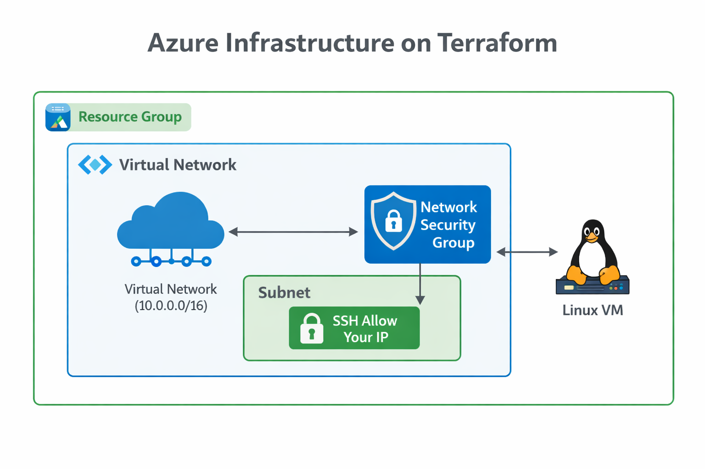

# Azure Infra Lab 🌐

Laboratório de **Infrastructure as Code (IaC)** utilizando **Terraform** para provisionamento de recursos no **Microsoft Azure**.

Este projeto foi desenvolvido com o objetivo de praticar automação de infraestrutura, organização de projetos DevOps e documentação técnica.

---

## 🔹 Descrição do Projeto

Este laboratório demonstra como provisionar infraestrutura básica de rede no Azure utilizando Terraform.

Durante o desenvolvimento foram realizados:

* Provisionamento de infraestrutura via Terraform
* Configuração de rede virtual e sub-rede
* Criação de Network Security Group (NSG)
* Restrição de acesso SSH ao IP público do administrador
* Organização do projeto em estrutura profissional de repositório
* Documentação da arquitetura e fluxo de provisionamento

> Nenhuma credencial ou informação sensível está presente neste repositório.

---

## 🏗️ Arquitetura da Infraestrutura



Documentação detalhada da arquitetura:

docs/architecture.md

---

## 🛠️ Tecnologias e Skills Utilizadas


---

## ☁️ Recursos Provisionados

A infraestrutura criada por este projeto inclui:

* Resource Group
* Virtual Network (VNet)
* Subnet
* Network Security Group (NSG)
* Regra de segurança liberando SSH apenas para o IP do administrador

Configuração de rede utilizada:

VNet: `10.0.0.0/16`
Subnet: `10.0.1.0/24`

---

## 📂 Estrutura do Repositório

```text
azure-infra-lab/
│
├─ terraform/
│  ├─ main.tf
│  ├─ providers.tf
│  ├─ variables.tf
│  ├─ outputs.tf
│  └─ .terraform.lock.hcl
│
├─ scripts/
│  ├─ init.sh
│  └─ destroy.sh
│
├─ docs/
│  └─ architecture.md
│
├─ diagrams/
│  └─ architecture.png
│
├─ README.md
└─ .gitignore
```

---

## ⚙️ Execução do Terraform

Inicializar o projeto:

```bash
terraform init
```

Validar configuração:

```bash
terraform validate
```

Gerar plano de execução:

```bash
terraform plan
```

Aplicar infraestrutura:

```bash
terraform apply
```

Remover infraestrutura:

```bash
terraform destroy
```

---

## 📊 Status do Projeto

✔ Infraestrutura criada com Terraform
✔ Testes realizados no Azure
✔ Provisionamento validado com sucesso
✔ Recursos removidos posteriormente para evitar custos na plataforma

Este repositório permanece como **laboratório de referência para provisionamento de infraestrutura no Azure utilizando Terraform**.

---

## 📚 Documentação

Documentação adicional pode ser encontrada em:

docs/architecture.md

---

## 👨‍💻 Autor

Projeto desenvolvido como laboratório de estudo em **Cloud Computing**, **DevOps** e **Infrastructure as Code** utilizando Terraform e Microsoft Azure.

